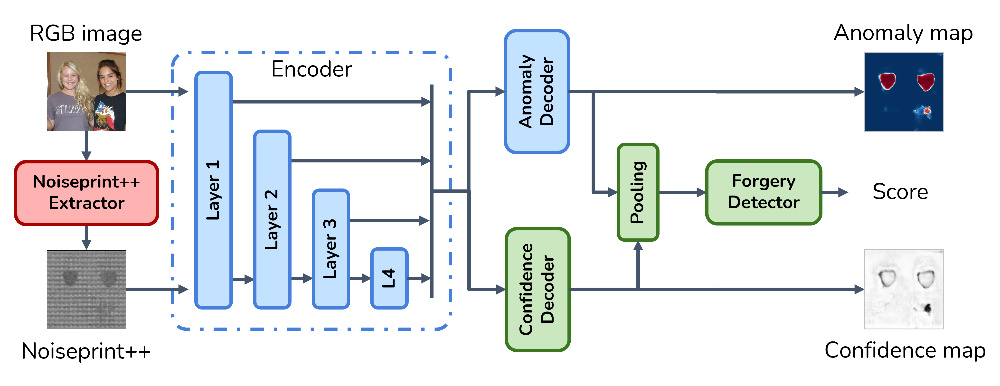

# TruFor


[](https://grip-unina.github.io/TruFor)
[](https://doi.org/10.48550/arXiv.2212.10957)
[](https://www.grip.unina.it)

## (Code Coming Soon)
Official PyTorch implementation of the paper "TruFor: Leveraging all-round clues for trustworthy image forgery detection and localization"

<p align="center">
 
</p>

 
## Overview
In this paper we present **TruFor**, a forensic framework that can be applied to a large variety of image manipulation methods, from classic cheapfakes to more recent manipulations based on deep learning. We rely on the extraction of both high-level and low-level traces through a transformer-based fusion architecture that combines the RGB image and a learned noise-sensitive fingerprint. The latter learns to embed the artifacts related to the camera internal and external processing by training only on real data in a self-supervised manner. Forgeries are detected as deviations from the expected regular pattern that characterizes each pristine image. Looking for anomalies makes the approach able to robustly detect a variety of local manipulations, ensuring generalization. In addition to a pixel-level **localization map** and a whole-image **integrity score**, our approach outputs a **reliability map** that highlights areas where localization predictions may be error-prone. This is particularly important in forensic applications in order to reduce false alarms and allow for a large scale analysis. Extensive experiments on several datasets show that our method is able to reliably detect and localize both cheapfakes and deepfakes manipulations outperforming state-of-the-art works.



<p align="center">
 
</p>


## Requirements


## License

## Bibtex
 
 ```
 @misc{Guillaro2022_trufor,
  doi = {10.48550/ARXIV.2212.10957},  
  url = {https://arxiv.org/abs/2212.10957},
  author = {Guillaro, Fabrizio and Cozzolino, Davide and Sud, Avneesh and Dufour, Nicholas and Verdoliva, Luisa},
  keywords = {Computer Vision and Pattern Recognition (cs.CV), FOS: Computer and information sciences, FOS: Computer and information sciences},
  title = {TruFor: Leveraging all-round clues for trustworthy image forgery detection and localization},
  publisher = {arXiv},
  year = {2022},
  copyright = {arXiv.org perpetual, non-exclusive license}
}
```

## Acknowledgments
 
We gratefully acknowledge the support of this research by the Defense Advanced Research Projects Agency (DARPA) under agreement number FA8750-20-2-1004. 
The U.S. Government is authorized to reproduce and distribute reprints for Governmental purposes notwithstanding any copyright notation thereon.
The views and conclusions contained herein are those of the authors and should not be interpreted as necessarily representing the official policies or endorsements, either expressed or implied, of DARPA or the U.S. Government.

In addition, this work has received funding by the European Union under the Horizon Europe vera.ai project, Grant Agreement number 101070093, and is supported by Google and by the PREMIER project, funded by the Italian Ministry of Education, University, and Research within the PRIN 2017 program.
Finally, we would like to thank Chris Bregler for useful discussions and support.
